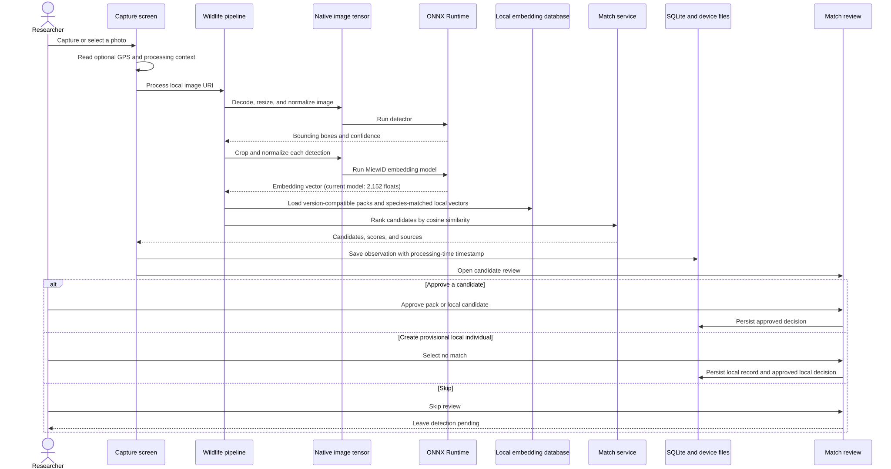
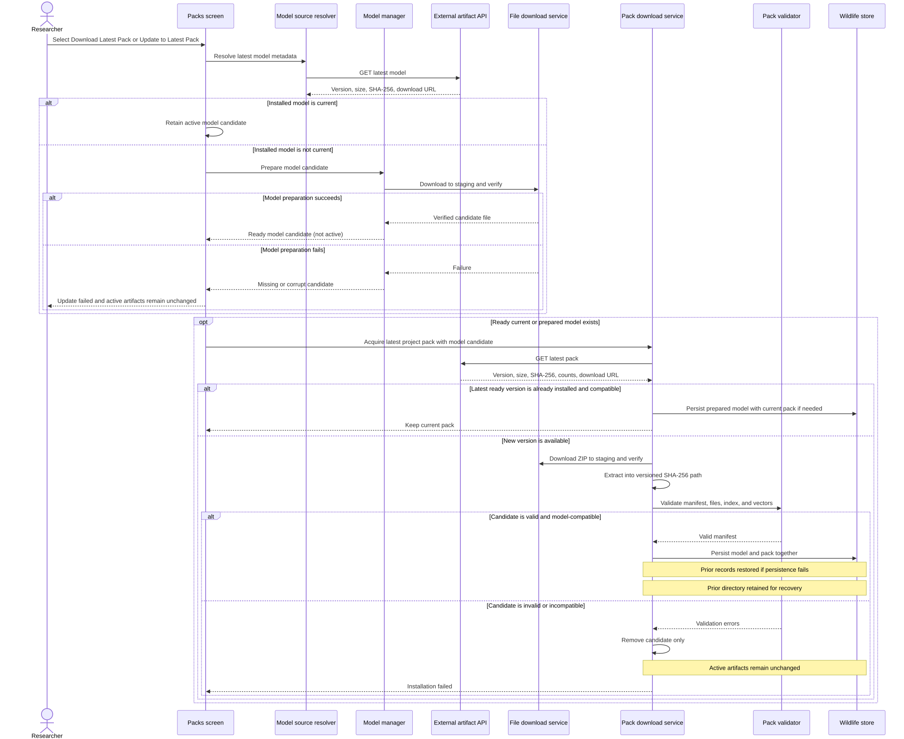

# Off-Grid Mobile Wildlife Re-ID Architecture

> Scope: `off-grid-mobile-wildlife-reid` only
>
> Prepared: 28 August 2026
>
> Status: Current implementation plus explicitly marked target improvements

## Scope

This document explains how the Off Grid mobile repository performs wildlife
identification, manages model and embedding-pack updates, persists field data,
and synchronizes reviewed observations.

It deliberately does not describe:

- Backend implementation, cloud-resource topology, or database internals.
- Model training or dataset-production pipelines.
- Product governance, milestones, repository access, or named ownership.
- A web/PWA implementation.
- The internal architecture of Wildbook or any other upstream catalog.

External systems appear only as interfaces consumed by the mobile app. A
specific reserve, organization, or population is pack content, not a change to
the mobile architecture.

## Architectural Conclusion

The repository implements an offline-first React Native application with four
clear runtime boundaries:

1. **On-device inference:** a detector finds and crops the animal, MiewID emits
   a 2,152-dimensional embedding, and cosine similarity ranks local candidates.
2. **Local persistence:** observations, detections, review decisions, and sync
   state survive loss of connectivity and process restarts.
3. **Artifact management:** the app downloads, verifies, installs, and checks
   compatibility between the embedding model and project-scoped packs.
4. **Online synchronization:** reviewed matches to known pack individuals can
   be uploaded through an external API adapter when connectivity is available.

The main architectural gaps are not offline inference. They are safe rollback
for model and pack replacement, background/reconnect orchestration, recovery of
stranded uploads, synchronization of provisional local individuals, complete
review/encounter-field capture, and an explicit upstream catalog integration
boundary.

## Technology and Runtime Boundaries

| Concern | Current implementation |
|---|---|
| Application shell | React Native with TypeScript and React Navigation |
| UI state | Zustand stores, with selected state persisted through AsyncStorage |
| Durable field records | SQLite through `@op-engineering/op-sqlite` |
| Device files | `react-native-fs` for photos, crops, models, packs, and staging |
| Inference runtime | `onnxruntime-react-native` |
| Native preprocessing | `ImageTensorModule` behind a TypeScript adapter |
| Model output | Manifest-driven embedding; the current MiewID path emits 2,152 floats |
| Identification | Brute-force cosine similarity against pack and local embeddings |
| Pack transport | ZIP download, SHA-256 and size verification, extraction, schema validation |
| Authentication | Native sign-in state consumed by the external API client |
| Observation transport | External API client plus direct file upload to a signed URL |

The dependency versions and native packages are defined in
[`package.json`](../package.json).

## System Context

Everything inside the device boundary belongs to this repository. Components
outside that boundary are contracts, not mobile-owned implementations.



[Edit Mermaid source](diagrams/system-context.mmd)

The mobile app does not connect directly to the research catalog. Its current
online boundary is the API represented by
[`ganeshaApiClient`](../src/services/ganeshaApiClient/index.ts). Whether that
API later exports to or synchronizes with another system does not alter the
offline identification path.

## Mobile Component Architecture



[Edit Mermaid source](diagrams/component-architecture.mmd)

### Component Responsibilities

| Component | Responsibility | Must not own |
|---|---|---|
| Screens and navigation | User interaction and route transitions | Inference, storage, or transport rules |
| Wildlife pipeline | Orchestrate detect, crop, embed, and match | Artifact publication or remote persistence |
| ONNX inference service | Session lifecycle and tensor execution | UI or observation policy |
| Embedding database builder | Merge compatible pack and local embeddings by species | Downloading or validating packs |
| Match service | Cosine scoring and candidate ranking | Researcher approval or authoritative identity creation |
| Model manager | Downloaded-model state, integrity, and compatibility | Pack contents or observation sync |
| Pack manager | Validate, index, install, reconcile, and quarantine packs | Producing packs from source data |
| Observation repository | Transactional local observation and detection persistence | Network calls |
| Wildlife store | App-facing model, pack, local-individual, and queue state | Source-of-truth research records |
| Sync engine | Select eligible records, upload, retry, and persist remote IDs | Direct research-catalog integration |
| External API client | Typed HTTP boundary used by the app | Backend implementation details |

## Offline Identification Flow

The complete identification path runs without a network after a model and pack
with matching normalized semantic versions have been installed.



[Edit Mermaid source](diagrams/offline-identification.mmd)

### Important Properties

- Detection and embedding run locally; network loss does not change the result.
- Matching uses embeddings from version-compatible installed packs plus
  provisional local individuals of the same species. Local individuals do not
  currently record model version or feature class, so a later model/feature
  change can make those local vectors unsafe to compare.
- Multiple detections in one observation are reviewed independently.
- Candidate ranking is evidence for a human decision, not an authoritative
  catalog mutation.
- The current Match Review UI can approve a candidate, create a provisional
  local individual, or skip. Skip leaves the detection pending; although the
  type supports `rejected`, this screen does not currently write that state.
- A failed or absent head detection must not be converted into a confident
  identity.

The orchestrator is
[`wildlifePipeline`](../src/services/wildlifePipeline/index.ts). ONNX session
management lives in
[`onnxInferenceService`](../src/services/onnxInferenceService/index.ts), and
candidate data is assembled by
[`embeddingDatabaseBuilder`](../src/services/embeddingDatabaseBuilder.ts).

## Local Data Architecture

| Data | Current storage | Lifecycle and authority |
|---|---|---|
| Original observation photo | Device file referenced by the observation | Local field evidence; retained independently of network availability |
| Detection crop | Device file referenced by the detection | Used for review and known-match upload |
| Observation metadata | SQLite | Post-inference processing timestamp, optional GPS, platform context, and field notes |
| Detection | SQLite | Bounding box, embedding, candidates, review decision, and remote submission ID |
| Sync queue item | SQLite-backed application state | Pending, uploading, synced, failed, or permanently failed |
| Embedding model | Device file plus persisted model record | Usable only when ready and compatible with the pack |
| Embedding pack | Extracted device files plus persisted metadata | Local, project-scoped search gallery |
| Provisional local individual | Persisted wildlife store | Device-local grouping without model/feature provenance; not an authoritative catalog identity |

The core domain types are defined in
[`wildlife.ts`](../src/types/wildlife.ts). Transactional observation access is
implemented by
[`observationsRepository`](../src/services/database/observationsRepository.ts),
while app-facing state is managed by
[`wildlifeStore`](../src/stores/wildlifeStore.ts).

### Observation Readiness

An observation can contain several detections. It is not ready for final sync
while any detection still has `reviewStatus: pending`. Once all detections have
been reviewed:

- Approved candidates originating from an installed pack are eligible to sync.
- The domain type and sync engine understand rejected detections, but the current
  Match Review UI does not provide an action that marks a detection rejected.
- Approved candidates originating from a provisional local individual are not
  uploaded by the current sync engine.

That last rule prevents a device-generated `FIELD-*` identifier from being
mistaken for an authoritative catalog identifier.

## Model and Pack Architecture

The embedding model and embedding pack are treated as one compatibility pair:

$$
\text{compatible} \iff
\text{installedModel.version} = \text{pack.embeddingModel.version}
$$

The app fails closed when normalized semantic versions differ, including patch
versions. This is narrower than full compatibility proof: the gate does not bind
the model name or hash, and the pipeline does not assert that model output length
equals the pack's declared `embeddingDim`. The linked pack specification's older
minor-version compatibility guidance is therefore stale relative to the code.

### Pack Contents

A pack is a ZIP archive containing the local identification database and the
detector needed to create compatible crops. The adopted layout is documented in
[`EMBEDDING_PACK_FORMAT.md`](EMBEDDING_PACK_FORMAT.md):

```text
pack.zip
|-- manifest.json
|-- models/
|   `-- detector.onnx
|-- config/
|   `-- detector.json
|-- embeddings/
|   |-- index.json
|   `-- embeddings.bin
`-- reference_photos/
    `-- <individual-id>/...
```

The pack does not need to contain the MiewID model itself. The model is managed
as a separate artifact so multiple project packs can share it.

### Current Update Flow



[Edit Mermaid source](diagrams/artifact-update.mmd)

### Existing Safety Controls

- Model and pack metadata include expected byte length and SHA-256.
- Downloads use staging paths before final placement.
- Pack validation checks required files, manifest values, binary size against
  the manifest-declared dimension, and index bounds.
- Startup reconciliation can quarantine invalid packs.
- Matching excludes quarantined or model-incompatible packs.
- The UI resolves the latest model before downloading the latest pack.
- Installed devices expose **Update to Latest Pack** on the Packs screen.
- On screen focus, a metadata-only version and archive-SHA check reports
  **Up to date** or **Update available** without downloading the pack.
- Model candidates are downloaded and verified without changing the active
  model. Pack candidates use versioned, SHA-256-suffixed directories and must
  pass full validation plus model-version compatibility. The model and pack
  records are then persisted together; a failed replacement restores the prior
  active records.
- Model cache filenames also include the expected SHA-256, so changed bytes
  cannot overwrite an active model even when a publisher reuses a version name.

### Current Limitations

- There is no background or reconnect-triggered pack check.
- Model and pack are resolved through separate latest-version calls; there is
  no single release descriptor binding an approved pair.
- Previous pack directories are retained, but there is no user-facing manual
  rollback action or retention limit for older versions.
- Standalone model acquisition can still publish a `downloading` state; the
  Packs-screen update transaction avoids that API and stages its candidate.
- `packManager` has a deletion method, but the current pack screens expose no
  delete or rollback action.
- The validator checks that the detector config file exists but does not validate
  its schema. An unreadable or malformed config silently falls back to a generic
  YOLOv5 configuration.

### Current Pack Activation

Each pack is installed into a distinct versioned directory. The persisted
Wildlife store record is replaced only after the candidate passes all checks:

```text
embedding_packs/
|-- <project-id>-<pack-version-a>/
`-- <project-id>-<pack-version-b>/
```

If download, extraction, or validation fails, the active store record and its
directory are untouched. After a successful activation the prior directory is
retained for recovery. A future improvement should cap retained versions and
provide a deliberate rollback action. A future model change should use one
release descriptor containing the model version/hash and compatible pack
version/hash.

The current implementation is in
[`PacksScreen`](../src/screens/PacksScreen.tsx),
[`packDownloadService`](../src/services/packDownloadService/index.ts),
[`fileDownloadService`](../src/services/fileDownloadService/index.ts), and
[`packManager`](../src/services/packManager/index.ts).

## Synchronization Architecture

Synchronization is deliberately separate from identification. The app can
identify, review, and save observations while offline; synchronization is a
later transport concern.

### Current Known-Match Flow

1. The researcher starts synchronization from the Sync screen.
2. The engine reads queue items with a retryable status.
3. It skips observations that still contain pending reviews.
4. For each approved **pack-sourced** detection without a remote submission ID,
   it requests a signed upload destination.
5. It streams the detection crop from the local filesystem.
6. It submits observation metadata and the approved stable individual ID.
7. It persists the returned submission ID on that detection.
8. If a later detection fails, a retry skips detections already carrying an ID.

Once a returned submission ID has been saved locally, later attempts skip that
detection. This is local duplicate suppression, not guaranteed end-to-end
idempotency: the app can terminate after the remote system accepts a submission
but before the returned ID is persisted. The request currently carries no
server-recognized idempotency key, so that crash window can duplicate a remote
record.



[Edit Mermaid source](diagrams/sync-state.mmd)

### What Current Sync Does Not Do

- It does not automatically run when connectivity returns.
- It does not recover a persisted `uploading` queue item on startup; bulk sync
  selects only `pending`, `failed`, and `failedPermanent`, so an interrupted
  upload can remain stranded.
- It does not upload provisional local individuals.
- It does not create an authoritative individual in an external catalog.
- It does not synchronize profile edits or catalog biographies.
- It does not currently expose all typed encounter fields through the UI.
- It does not implement a mobile-to-Wildbook client.

These are separate features, not hidden capabilities of the existing queue.

The behavior is controlled by
[`syncEngine`](../src/services/syncEngine/index.ts) and presented by
[`SyncScreen`](../src/screens/SyncScreen.tsx).

## Provisional New Individuals

The Match Review screen can create a local individual when no pack candidate is
accepted. That record contains a generated local ID, user label, species,
embedding, reference crop, first-seen time, encounter count, and unresolved
external ID.

Architecturally, this is a **local learning aid and grouping mechanism**. It is
not central catalog creation. Subsequent observations can match against its
embeddings because the embedding database builder merges local and pack
vectors.

The current record does not carry embedding-model version, feature class, pack
context, or vector dimension. Until those fields are added and enforced, local
vectors should be cleared, migrated, or excluded whenever the active embedding
space changes.

To make this data portable without coupling the app to a particular catalog,
add an export/sync contract for provisional individuals containing:

- Stable mobile observation and detection IDs.
- Local individual ID and user label.
- Source capture time when available, otherwise a processing timestamp with its
  provenance, plus optional authorized location.
- Original image and detection crop references.
- One or more embeddings with model version.
- Candidate list and researcher decision.
- Review status and eventual external ID.

The external system can accept, reject, merge, or create the authoritative
identity and return a mapping. That mapping can then reconcile local records.

Current creation behavior is in
[`MatchReviewScreen`](../src/screens/MatchReviewScreen/index.tsx).

## Metadata Boundaries

| Metadata | Mobile responsibility | External responsibility |
|---|---|---|
| Capture timestamp | Currently saved after GPS and inference; add source/EXIF provenance if original capture time is required | Interpret as encounter metadata |
| GPS | Best-effort capture; permit missing value; protect locally and in transit | Authorization, retention, and research use |
| Field notes | Persist with the observation and include when eligible | Review and map into research records |
| Candidate scores | Preserve with model and pack context | Never treat score alone as biological truth |
| Display name | Read from pack for offline display | Own the authoritative identity and naming |
| Reference photos | Display pack-provided, metadata-stripped copies | Select and publish approved references |
| Sex, life stage, behavior, location ID | Schema-only placeholders: initialized to `null`, not edited by the current UI, and omitted by sync | Define vocabulary and authoritative mapping |
| Queue and retry state | Mobile-only operational state | No research meaning |
| App/model/pack version | Not stored per observation today; add explicit provenance fields | Use for audit and compatibility analysis |

Precise location, device identifiers, and unrestricted research notes must not
be added to broadly distributed packs. The app should receive only the minimum
offline profile snapshot needed to identify and review candidates.

## Failure Behavior

| Failure | Required mobile behavior | Current status |
|---|---|---|
| No network | Continue identification, review, and local save | Implemented |
| No usable pack | Block matching and direct the user to pack management | Partial: incompatible healthy packs are blocked, but an empty or all-quarantined config set can save a zero-detection observation |
| Corrupt pack | Quarantine or reject it; exclude it from matching | Implemented |
| Model/pack mismatch | Block matching rather than search incompatible vectors | Implemented for exact normalized version equality only |
| No detection | Report no usable detection; never invent a match | Implemented pipeline outcome |
| Ambiguous candidates | Preserve ranked evidence for human review | Implemented |
| App/process termination | Retain field data and return interrupted uploads to a retryable state | Partial: data persists, but `uploading` is not recovered on startup |
| Partial multi-detection upload | Persist completed detection IDs and retry the remainder without remote duplicates | Partial: local IDs skip persisted successes, but the accept-before-persist crash window remains |
| Replacement pack fails validation | Keep the active last-known-good pack | Implemented; physical interruption and low-storage tests pending |
| Connectivity returns | Offer or trigger policy-controlled sync | Manual only |
| Provisional individual needs central review | Export/sync without inventing an authoritative ID | Not implemented |

Observation photos and crops are copied or moved into app-private document
storage before the SQLite insert completes. However, the current store `reset`
clears database rows without deleting those observation directories, so there
is no complete retention/reset policy and orphaned files can remain.

## Short Answers to the Meeting Questions

These answers cover the Off Grid mobile repository only. Dataset ownership,
model training, backend implementation, and final product scope are external
decisions; their effects on the mobile architecture are stated where relevant.

### Product and Prioritization

#### 1. Who decides September scope versus later releases?

The repository cannot decide this. One product or field owner should make the
scope decision using mobile acceptance evidence. Architecturally, anything not
required for capture, offline identification, durable save, review, and safe
export/sync should not block the field prototype.

#### 2. What is mandatory for field testing versus V1.0?

**Field test:** preinstalled compatible model and pack, camera/gallery input,
on-device detection and embedding, local cosine ranking, candidate review,
durable photos/notes/GPS, visible queue state, and a tested recovery/export
path. **Later:** background sync, automatic pack checks, atomic rollback,
provisional-individual reconciliation, complete encounter forms, dynamic
projects, production iOS support, and broader device optimization.

#### 3. Should new-individual creation ship before the field trip?

Ship **provisional** creation, not authoritative catalog creation. The app
already creates local `FIELD-*` individuals and can match later observations to
them, but it cannot upload or reconcile them. A field prototype must preserve
and export that evidence; assigning the permanent research identity belongs to
an external reviewed workflow.

### Model and Data

#### 4. Should the model be fine-tuned with newer data?

That is an ML decision outside this repository. For the mobile release, keeping
the current model stable is lower risk. A fine-tuned model is a new embedding
space and therefore requires a new model artifact, regenerated packs, device
parity tests, compatibility metadata, and threshold revalidation.

#### 5. Is offline evaluation on unseen newer data required?

Yes. The mobile app must be tested with fixed images that were not used to build
the searchable gallery, including known and unknown individuals. The existing
golden-batch evaluator can run the production detector, crop, embedding, and
matching path without UI, but clean dataset selection and labels must be
provided externally.

#### 6. How much improvement comes from fine-tuning versus new embeddings?

The mobile repository cannot provide a defensible number. A refreshed pack adds
individuals and reference viewpoints without changing the feature extractor;
fine-tuning may improve embedding quality but changes every compatibility and
release artifact. Compare both approaches on the same fixed on-device test set
before changing the shipped model.

#### 7. How should validation data be reserved?

Reserve data by encounter, not by adjacent image, to avoid near-duplicate
leakage. Keep one immutable mobile acceptance set with expected detections,
embedding similarity tolerances, candidate ranking, and unknown rejection. The
app consumes this set for parity testing; it must not be used to build the pack.

### Pack Refresh and Device Updates

#### 8. How are embeddings refreshed so all individuals are available?

An external process builds a new project pack. The app consumes that pack
through its existing metadata/download contract. If the embedding-model version
and pack schema remain compatible, this is a pack-only update and requires no
application-code change.

#### 9. Is automated refresh or synchronization needed?

Not for the first controlled field test: install and verify an approved pack on
every device before departure. It is valuable later to check for staleness and
download in the background, but activation must remain validation-gated. The
current UI exposes **Download Latest Pack** when empty and **Update to Latest
Pack** when a pack is installed.

#### 10. Does Off Grid Mobile already provide sufficient synchronization?

Only partially. It supports user-triggered, retryable upload of reviewed matches
to known pack individuals. It does not auto-sync on reconnect, recover a queue
item stranded as `uploading`, sync provisional individuals, populate all
encounter fields, or synchronize with an upstream research catalog.

#### 11. How are updated models and packs delivered to devices?

The app requests latest-version metadata, downloads from the supplied URL into
staging, verifies expected size and SHA-256, validates the pack structure, and
checks normalized model-version equality. A candidate model remains inactive
while the pack is prepared. Pack versions are extracted into separate
SHA-256-suffixed directories, then model and pack records are persisted together
only after full validation, so a failed update preserves the working pair. A
manual pack rollback is not yet exposed in the UI.

### Researcher Workflow

#### 12. How should field data be uploaded to the research system?

Use the mobile app's existing external API boundary or a standards-based export.
The phone should send a durable observation ID, photos/crops, optional GPS,
notes, decision, candidate evidence, and artifact provenance. An external
reviewed integration should translate that record into the research system and
return permanent encounter or individual IDs.

#### 13. Should the phone call the research-system API directly or export data?

Prefer export or an intermediary API, not a catalog-specific mobile client.
This keeps long-lived credentials, schema translation, approval, throttling,
and retry policy outside the app. It also allows the external system to change
without rebuilding the offline inference workflow.

#### 14. How should metadata, photos, GPS, and new individuals be handled?

Photos and crops are copied into app-private document storage; GPS is optional;
notes and match decisions are persisted with the observation. The current
timestamp is recorded after inference, so true capture-time provenance needs an
additional source field. Known pack matches can use stable pack IDs;
new individuals remain local `FIELD-*` records until external review.

### Field Data Management

#### 15. How should biography and research notes be synchronized?

Treat pack biographies as a read-only offline snapshot. Field notes belong to a
specific observation and can be exported or submitted with it; they should not
silently overwrite an individual's biography. Two-way profile editing and
conflict resolution are not implemented in this repository.

#### 16. Are additional app-specific fields required upstream?

Do not push mobile operational fields upstream. Queue status, retry count,
device-local IDs, file paths, and download state belong in the app. Only durable
research facts such as encounter time, approved location, sex, life stage, and
behavior should cross the boundary, using an agreed schema; those encounter
fields currently exist only as `null` placeholders in the mobile types.

### Position on the Main Proposals

| Proposal | Recommendation |
|---|---|
| Refresh the embedding pack | **Do first.** It is the lowest-risk way to add current individuals while keeping the model stable |
| Fine-tune immediately | **Do not make it a mobile release dependency.** Prove improvement first; it forces a coordinated model-and-pack migration |
| Rely on existing sync | **Use it as a foundation only.** Known-match foreground upload works; reconnect recovery, provisional records, and catalog sync do not |
| Automatically install every update | **No.** Automate checks and validation, but activate only an approved compatible artifact with rollback available |
| Create permanent individuals on the phone | **No.** Preserve provisional identities locally and reconcile them through external review |
| Connect the phone directly to Wildbook | **No.** Keep the mobile app behind a stable external API/export contract |

**Recommended field architecture decision:** keep the mobile model stable,
install an approved refreshed pack before travel, run all identification and
review offline, preserve every observation durably, use explicit foreground
sync/export, and treat unknown individuals as provisional until reviewed outside
the phone.

## Recommended Architecture Work

These are mobile-repository improvements, ordered by dependency rather than a
product schedule:

1. **Pack retention and manual rollback:** cap retained versioned directories
  and expose deliberate recovery to the last-known-good pack.
2. **Bound model-pack releases:** consume one release descriptor when a model
   change requires a coordinated compatible pack.
3. **Connectivity orchestrator:** centralize network state and trigger a
  policy-controlled sync attempt while preserving the existing manual action;
  recover stale `uploading` records to a retryable state at startup.
4. **Provisional-individual transport:** add an external contract and local
  reconciliation state without teaching the app a catalog-specific API; store
  model version, feature class, vector dimension, and source pack context.
5. **Encounter-field completion:** surface the existing typed fields in review,
  add an explicit reject action, validate controlled vocabularies, and persist
  them transactionally.
6. **Dynamic project context:** remove assumptions that only one configured
   project pack can be selected or downloaded.
7. **Retention and privacy controls:** document and enforce local photo, crop,
   embedding, GPS, and failed-upload retention behavior.
8. **Cross-platform acceptance:** validate the same golden inputs, artifact
   compatibility, persistence, and recovery behavior separately on supported
   Android and iOS devices.
9. **End-to-end idempotency:** send a stable client operation ID that the remote
  API can enforce across the accept-before-local-persist crash window.
10. **Artifact contract hardening:** bind model name/hash and embedding dimension,
   validate detector config structure, and block empty/all-quarantined capture.

## Architecture Validation Scenarios

The following tests provide direct evidence that the boundaries hold:

1. Install a valid model/pack pair, enable airplane mode, identify and review an
   image, terminate the process, and confirm the full observation returns.
2. Install a pack with the wrong model version and confirm capture cannot
   produce candidates from it.
3. Corrupt `embeddings.bin` or its checksum and confirm installation fails and
   the pack is excluded.
4. Review multiple detections, fail one upload after another succeeds, retry,
   and confirm no duplicate remote submission is created.
5. Create a provisional local individual, match a later observation against it,
   and confirm the sync engine does not submit it as a pack identity.
6. Deny location permission and confirm capture, identification, review, and
   sync remain valid with nullable GPS.
7. Replace a working pack with an invalid candidate and verify the active pack
  remains usable through failure, process restart, and low-storage conditions.
8. Run identical images through supported device platforms and compare
   detection, embedding cosine, candidate order, and persistence output.

Existing coverage includes pack loading, pipeline flow, embedding database
construction, screen behavior, and authentication gates under
[`__tests__`](../__tests__).

## Source Map

### Diagram Maintenance

This document embeds generated SVG files because this workspace's standard VS
Code Markdown preview does not render Mermaid fences. The editable sources are
the `.mmd` files in [`docs/diagrams`](diagrams). After changing one, regenerate
its SVG from the repository root:

```powershell
npx --yes @mermaid-js/mermaid-cli -i docs/diagrams/<name>.mmd -o docs/diagrams/<name>.svg -b transparent
```

The SVG is the preview artifact; the `.mmd` file remains the source of truth.

- [`App.tsx`](../App.tsx): application initialization and top-level gates.
- [`src/navigation`](../src/navigation): workflow navigation.
- [`src/screens`](../src/screens): field workflow presentation.
- [`wildlifePipeline`](../src/services/wildlifePipeline/index.ts): offline
  detection, embedding, and matching orchestration.
- [`onnxInferenceService`](../src/services/onnxInferenceService/index.ts): model
  session lifecycle and execution.
- [`embeddingMatchService`](../src/services/embeddingMatchService/index.ts):
  cosine candidate ranking.
- [`embeddingDatabaseBuilder`](../src/services/embeddingDatabaseBuilder.ts):
  pack and local-individual vector assembly.
- [`miewidModelManager`](../src/services/miewidModelManager/index.ts): embedding
  model acquisition and compatibility.
- [`packDownloadService`](../src/services/packDownloadService/index.ts): latest
  pack acquisition and installation.
- [`packManager`](../src/services/packManager/index.ts): validation,
  reconciliation, indexing, and quarantine.
- [`observationsRepository`](../src/services/database/observationsRepository.ts):
  durable observation transactions.
- [`wildlifeStore`](../src/stores/wildlifeStore.ts): application-facing state.
- [`syncEngine`](../src/services/syncEngine/index.ts): known-match upload and
  retry behavior.
- [`ganeshaApiClient`](../src/services/ganeshaApiClient/index.ts): external API
  contract used by artifact and observation flows.
- [`wildlife.ts`](../src/types/wildlife.ts): shared mobile domain types.
- [`EMBEDDING_PACK_FORMAT.md`](EMBEDDING_PACK_FORMAT.md): pack contract.
